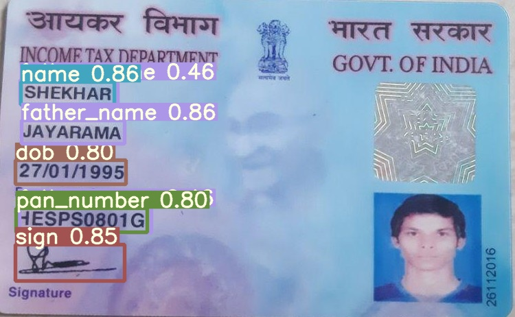

## Pancard Verification Using Pytorch

extracting details from pan cards using simple image processing will be difficult
we are using yolo-v5 object detector to extract name, father_name, dob, pan_number and signature
then we feed it to OCR like tesseract in this case to obtain the details

please look into inference_pan.ipynb and tutorial.ipynb notebook for more details

## Results

ocr_output

{'name': 'SHEKHAR',
 'father_name': 'JAYARAMA',
 'dob': '27/01/1995',
 'pan_number': 'HESPS0801G',
 'sign': 'Shae'}

## Pretrained Checkpoints
pretrained weights included in weights directory

## Requirements

Python >= 3 or later with all [requirements.txt]
dependencies installed, including `torch>=1.6`. To install run:
and pytesseract 

## Training
for pancard annotation data [link will update soon] visit here.
to train yolov5 model please follow this link
https://blog.roboflow.com/how-to-train-yolov5-on-a-custom-dataset/

